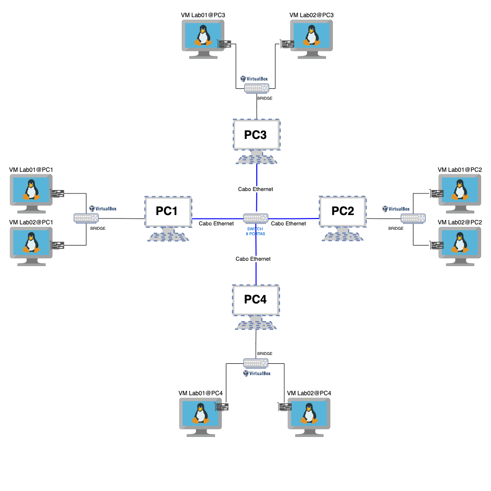

# Grupo 3 - 914

Turma 914/Grupo 3
 
Integrantes: Gabriel, Rityelle, Miguel e Luiza.

## Projeto 2º Bimestre das Disciplinas de Infraestrutura e Serviços de Redes (PRIR/SRED e ISRE).

### Objetivo:
* Configurar e executar um ambiente de rede virtualizado entre 8 VMs (com o S.O. Ubuntu Server) dispostas em 4 computadores distintos.
* Realizar os testes de ping e acesso SSH utilizando os usuários criados nas VMs e os nomes dos hosts.
* Listar a configuração de hardware utilizada em cada MV.
* Apresentação do roteiro contendo o passo-a-passo de configuração e execução do ambiente de rede virtualiza.

 Topologia da Rede

   
   

## Projeto Final 4º Bimestre das Disciplinas de Infraestrutura e Serviços de Redes (PRIR/SRED e ISRE).

### Objetivo:
* Configurar e executar um ambiente de rede virtualizado entre 8 VMs (com o S.O. Ubuntu Server) dispostas em 4 computadores distintos.
* Realizar os testes de ping e acesso SSH utilizando os usuários criados nas VMs e os nomes dos hosts.
* Listar a configuração de hardware utilizada em cada MV.
* Apresentação do roteiro contendo o passo-a-passo de configuração e execução do ambiente de rede virtualiza.
