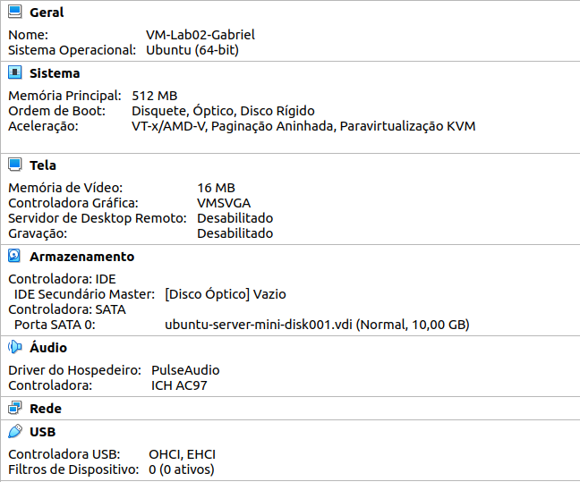

# Configuração de hardware utilizada em cada MV:
* Todas as VMs da rede virtualizada foram criadas com o mesmo arquivo OVA, por este motivo todas possuem as mesmas configurações de hardware, que estão listada na imagem abaixo:

 Características de Hardware das VMS

   
   
