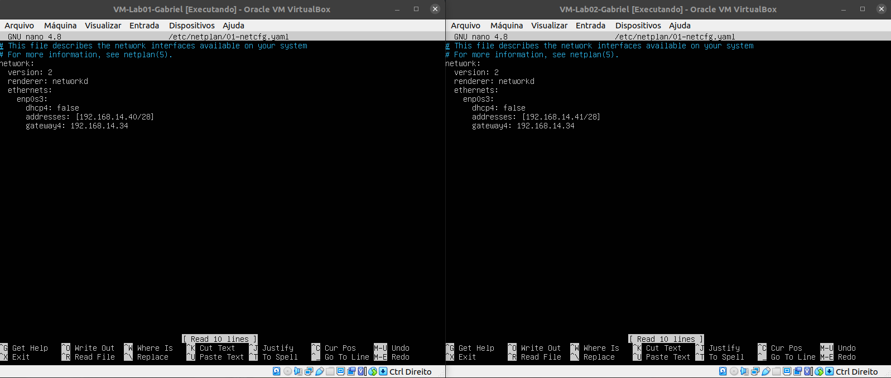
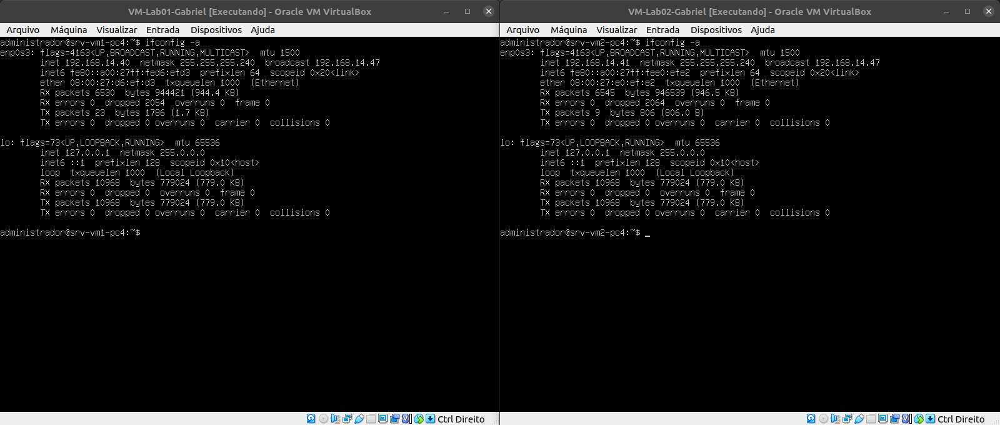

# Roteiro de Configuração e Execução

## Objetivo:
* Exemplificar o passo a passo das etapas realizadas para a configuração e execução do ambiente de rede virtualizada, desde a criação da VMs até as tentativas de comunicação entre as unidades da rede virtualizada, com os testes de Ping e SSH.

## Criação das VMs

### Criação de Diretórios
#### Criação dos diretórios que comportaram a imagem OVA e a VMs.
* Logar no usuário ``redes`` com a senha ``admin@Lab92``:
```
su redes
```
* Criar a pasta ``labredes`` no diretório raiz ``/``:
```
cd /
sudo mkdir labredes
```
* Criar os diretórios de ``labredes``. Neste caso, são: ``images/original`` e o ``VM/914/<Estudante>``:
```
cd /labredes
sudo mkdir images
cd images
sudo mkdir original

cd /labredes
sudo mkdir VM
cd VM
sudo mkdir 914
cd 914
sudo mkdir <Estudante>
```

### Usuários e Permissões
#### Concessão de permissões para os diretórios, arquivos e pastas.
* Adicionar o usuário ``aluno`` ao grupo ``redes``:
```
sudo usermod -aG redes aluno
```
* Modificar as permissões do diretório ``/labredes``:
```
sudo chown -R nobody:nogroup /labredes
sudo chgrp -R redes /labredes
sudo chmod -R 771 /labredes
```

### Baixar a imagem OVA do Ubuntu Server
* Baixar a imagem ``ubuntu-22.04-live-server-amd64.iso`` do PC do Professor Alaelson para o diretório ``/labredes/images/original``:
```
scp aluno@192.168.101.10:~/Public/iso-images/ubuntu-server-mini.ova /labredes/images/original
```

### Instalar o Virtualbox Extension Pack
* Instalar o pacote para a extensão do VirtualBox:
```
sudo apt install virtualbox-ext-pack
```

### Criação e Configuração das VMs no VirtualBox
#### Nesta etapa criamos todas as 8 VMs distribuídas nos 4 PCs.
* Importamos o arquivo OVA a partir da opção ``Importar Appliance``; e
* Definimos o diretório ``/VM/914/<Estudante>``, no qual a VM foi salva.

## Configuração das VMs

### Inicialização das VMs
* Logar com o usuário ``administrador`` com a senha ``adminifal``.

### Instalação das ferramentas de rede nas VMS
```
sudo apt install net-tools -y
```

## SSH-Server

### Atribuindo nome aos servidores ``hostname``, seguindo a tabela das VMs:
```
sudo hostnamectl set-hostname <hostname>
```

<p><center> Definindo o nome do hostname da VM1 e VM2 do PC1 </center></p>   
   
  
<br>

<p><center> Definindo o nome do hostname da VM1 e VM2 do PC2 </center></p>   
   
  
<br>

<p><center> Definindo o nome do hostname da VM1 e VM2 do PC3 </center></p>   
   
  
<br>

<p><center> Definindo o nome do hostname da VM1 e VM2 do PC4 </center></p>   
   

### Instalando o servidor SSH
#### Nesta etapa instalamos e atualizamos as definições e versões de pacotes/bibliotecas dos repositórios do ubuntu, instalamos o SSH Server, verificamos os status das portas e o funcionamento de Firewall.
* Atualizando os pacotes com as definições e versões:
```
sudo apt update
sudo apt upgrade -y
```
* Instalando o SSH Server:
```
sudo apt-get install openssh-server
```
* Verificando o status das portas do sistema:
```
netstat -an | grep LISTEN.
```
<p><center> Verificando o status das portas do sistema das VMs PC1</center></p>   
   

<p><center> Verificando o status das portas do sistema das VMs PC2</center></p>   
   

<p><center> Verificando o status das portas do sistema das VMs PC3</center></p>   
   

<p><center> Verificando o status das portas do sistema das VMs PC</center></p>   
   
	
* Configurando o Firewall:
```
sudo ufw allow ssh.
sudo ufw enable
```

## Configuração da Interface de Rede

```
------------------------------------------------------------------------------------------------------------
|  DESCRICAO  |       IP         |      hostname     |               FQDN               |      aliase      |
------------------------------------------------------------------------------------------------------------
| VM1-PC1     | 192.168.14.34    |   srv-vm1-pc1     | vm01-pc1.grupo3-914.ifalara.net  |       vpn        |
| VM2-PC1     | 192.168.14.35    |   srv-vm2-pc1     | vm02-pc1.grupo3-914.ifalara.net  |       mail       |
| VM1-PC2     | 192.168.14.36    |   srv-vm1-pc2     | vm01-pc2.grupo3-914.ifalara.net  |       www        |
| VM2-PC2     | 192.168.14.37    |   srv-vm2-pc2     | vm02-pc2.grupo3-914.ifalara.net  |       file       |
| VM1-PC3     | 192.168.14.38    |   srv-vm1-pc3     | vm01-pc3.grupo3-914.ifalara.net  |       sql        |
| VM2-PC3     | 192.168.14.39    |   srv-vm2-pc3     | vm02-pc3.grupo3-914.ifalara.net  |       mint       |
| VM1-PC4     | 192.168.14.40    |   srv-vm1-pc4     | vm01-pc4.grupo3-914.ifalara.net  |       beans      |
| VM2-PC4     | 192.168.14.41    |   srv-vm2-pc4     | vm02-pc4.grupo3-914.ifalara.net  |       url        |
------------------------------------------------------------------------------------------------------------
```

### Configurar o IP Estático na Interface de Rede
* Editar o arquivo YAML do Ubuntu, neste cado o ``01-netcfg.yaml``:
```
sudo nano /etc/netplan/01-netcfg.yaml
```

<p><center> Configuração da Interface de Rede das VMs do PC1 </center></p>   
   
  
<br>

<p><center> Configuração da Interface de Rede das VMs do PC2 </center></p>   
   
  
<br>

<p><center> Configuração da Interface de Rede das VMs do PC3 </center></p>   
   
  
<br>

<p><center> Configuração da Interface de Rede das VMs do PC4 </center></p>   
   
  
* Aplicando as configuraçães:
```
sudo netplan apply
```
 
* Configuração da Interface de Rede das VMs através do ``ifconfig -a``:

<p><center> Configuração da Interface de Rede das VM1 e VM2 do PC1 </center></p>   
   
  
<br>

<p><center> Configuração da Interface de Rede as VM1 e VM2 do PC2 </center></p>   
   
  
<br>

<p><center> Configuração da Interface de Rede as VM1 e VM2 do PC3 </center></p>   
   
  
<br>

<p><center> Configuração da Interface de Rede as VM1 e VM2 do PC4 </center></p>   
   

### Configurando a Placa de Rede para Modo Bridge:
* Nesta etapa configuramos a placa de redes no Adaptador 1 em todas as VMs para o Modo Bridgo, assim como a imagem abaixo mostra:

<p><center> Configurando a Placa de Rede para Modo Bridge na VM1 e VM2 do PC1 </center></p>   
   
    
	
<p><center> Configurando a Placa de Rede para Modo Bridge na VM1 e VM2 do PC2 </center></p>   
   
    

<p><center> Configurando a Placa de Rede para Modo Bridge na VM1 eVM2 do PC3 </center></p>   
   
    

<p><center> Configurando a Placa de Rede para Modo Bridge na VM1 do PC4 </center></p>   
    
    

## Criacão dos usuários nas VMs
### Cada VM possui o usuário administrador, então criamos em cada VM mais 4 usuários com os nomes dos integrantes do grupo.
* Para isso usamos o ``sudo adduser <usuario>``:

<p><center> Usuários criados nas VM1 e VM2 do PC1 </center></p>   
   
  
<br>

<p><center> Usuários criados nas VM1 e VM2 do PC2 </center></p>   
   
  
<br>

<p><center> Usuários criados nas VM1 e VM2 do PC3 </center></p>   
   
  
<br>

<p><center> Usuários criados nas VM1 e VM2 do PC4 </center></p>   
   

## Configurando o serviço de nomes estático
```
------------------------------------------------------------------------------------------------------------
|  DESCRICAO  |       IP         |      hostname     |               FQDN               |      aliase      |
------------------------------------------------------------------------------------------------------------
| VM1-PC1     | 192.168.14.34    |   srv-vm1-pc1     | vm01-pc1.grupo3-914.ifalara.net  |       vpn        |
| VM2-PC1     | 192.168.14.35    |   srv-vm2-pc1     | vm02-pc1.grupo3-914.ifalara.net  |       mail       |
| VM1-PC2     | 192.168.14.36    |   srv-vm1-pc2     | vm01-pc2.grupo3-914.ifalara.net  |       www        |
| VM2-PC2     | 192.168.14.37    |   srv-vm2-pc2     | vm02-pc2.grupo3-914.ifalara.net  |       file       |
| VM1-PC3     | 192.168.14.38    |   srv-vm1-pc3     | vm01-pc3.grupo3-914.ifalara.net  |       sql        |
| VM2-PC3     | 192.168.14.39    |   srv-vm2-pc3     | vm02-pc3.grupo3-914.ifalara.net  |       mint       |
| VM1-PC4     | 192.168.14.40    |   srv-vm1-pc4     | vm01-pc4.grupo3-914.ifalara.net  |       beans      |
| VM2-PC4     | 192.168.14.41    |   srv-vm2-pc4     | vm02-pc4.grupo3-914.ifalara.net  |       url        |
------------------------------------------------------------------------------------------------------------
```
* Editando os arquivo /etc/hosts conforme as definições da Tabela acima:
```
sudo nano /etc/hosts
```

<p><center> Arquivo /etc/hosts da VM1 e VM2 do PC1 </center></p>   
   
  
<br>

<p><center> Arquivo /etc/hosts da VM1 e VM2 do PC2 </center></p>   
   
  
<br>

<p><center> Arquivo /etc/hosts da VM1 e VM2 do PC3 </center></p>   
   
  
<br>

<p><center> Arquivo /etc/hosts da VM1 e VM2 do PC4 </center></p>   
   

## Configuração do HostOnly
### Configurando o acesso remoto às uma VM da rede pelo terminal do PC via ssh
* Nesta etapa criamos uma interface no computador para comunicação entre o Host (PC) e a VM.

## Testes de Ping e Acessso SSH

##  Resultados dos testes de Ping e acesso SSH utilizando os usuários criados nas VMs e os nomes dos hosts.
